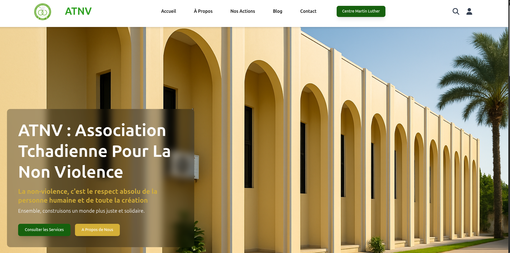

# ATNV - Association Tchadienne pour la Non-Violence

Site vitrine web de l’**Association Tchadienne pour la Non-Violence (ATNV)**, une ONG fondée en 1992 et basée à Moundou, Tchad. Ce projet présente les missions, services et actions de l’association, avec un design moderne, clair et responsive.

---

## Capture d'écran de l'accueil



[Voir le dépôt GitHub](https://github.com/doudouabdoulaye/ATNV)

---

## Technologies utilisées

- React (avec Vite)
- Tailwind CSS
- React Router
- Git & GitHub

---

## Structure du projet


src/
├── assets/ # Images, logos et ressources statiques
├── components/ # Composants réutilisables
│ ├── Header.tsx # Navigation principale avec menu responsive
│ ├── Hero.tsx # Section héro principale
│ ├── Features.tsx # Sections fonctionnalités/services
│ ├── Sidebar.tsx # Barre latérale (optionnelle)
│ └── Footer.tsx # Pied de page
├── layouts/ # Layouts globaux des pages
│ ├── MainLayout.tsx # Layout principal (Header + Footer)
│ └── SidebarLayout.tsx # Layout avec sidebar
├── pages/ # Pages du site
│ ├── Home.tsx # Page d'accueil
│ ├── AboutUs.tsx # À propos de l'association
│ ├── NosActions.tsx # Actions et projets de l’association
│ ├── Blog.tsx # Blog / actualités
│ └── Contact.tsx # Page contact
└── App.tsx # Composant racine avec routing


 
---

## Fonctionnalités

- Présentation complète de l’association et de ses services
- Navigation fluide et responsive
- Interface claire et accessible
- Menu hamburger sur mobile
- Formulaire de contact simple
- Section blog dynamique

---

## Services présentés

### Location de salle

- Mise à disposition d’espaces pour événements associatifs

### Media Lab

- Ateliers multimédias et formations numériques

### Accompagnement au développement rural

- Projets d’économie circulaire et développement durable

### Bibliothèque

- Espace de ressources et lecture

---

## Lancer le projet en local

```bash
npm install
npm run dev


